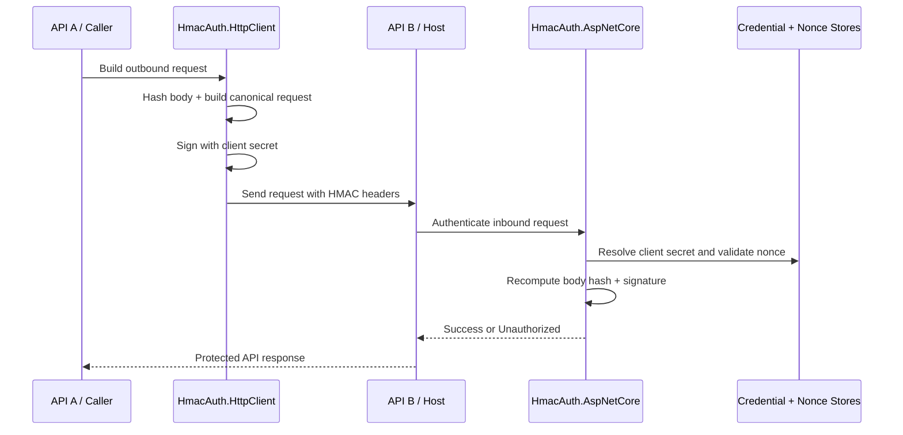

# HmacAuth

Reusable `.NET 8` HMAC authentication components for service-to-service APIs.

## License

This project is licensed under the MIT License. See [LICENSE](LICENSE).

## Projects

- `src/HmacAuth.Core`
  Shared canonicalization, hashing, and signature primitives.
- `src/HmacAuth.AspNetCore`
  ASP.NET Core authentication handler for verifying inbound HMAC requests.
- `src/HmacAuth.HttpClient`
  `DelegatingHandler` for signing outbound `HttpClient` requests.
- `samples/HmacAuth.SampleHost`
  Runnable sample API that verifies signed requests.
- `samples/HmacAuth.SampleCaller`
  Runnable sample API that signs outbound requests to the sample host.
- `tests/HmacAuth.Tests`
  End-to-end tests covering success, replay rejection, and expired timestamps.

## Usage

This library is intended for service-to-service authentication:

- API A signs outbound requests.
- API B verifies the signature and authenticates API A as a caller.

Both APIs can reference the same solution, but use different packages:

- API A references `HmacAuth.HttpClient` and `HmacAuth.Core`
- API B references `HmacAuth.AspNetCore` and `HmacAuth.Core`

## Flow



## Samples

Two runnable sample apps are included:

- `samples/HmacAuth.SampleHost`: secured API listening on `http://localhost:5081`
- `samples/HmacAuth.SampleCaller`: caller API listening on `http://localhost:5082`

Run them in separate terminals:

```bash
dotnet run --project samples/HmacAuth.SampleHost --launch-profile http
dotnet run --project samples/HmacAuth.SampleCaller --launch-profile http
```

Then exercise the flow:

```bash
curl http://localhost:5081/public/ping
curl http://localhost:5082/call/whoami
curl -X POST http://localhost:5082/call/echo -H "Content-Type: application/json" -d "{\"message\":\"hello\"}"
```

The sample apps share these dev-only credentials through their `appsettings.json` files:

- client id: `sample-caller`
- secret: `dev-only-secret`

## API B: verify incoming HMAC requests

`appsettings.json`:

```json
{
  "HmacAuthentication": {
    "AllowedClockSkew": "00:05:00",
    "RequireNonceValidation": true
  }
}
```

Settings:

- `AllowedClockSkew`: the maximum allowed difference between the request timestamp and the API server clock. Use standard `TimeSpan` format such as `00:05:00` for 5 minutes.
- `RequireNonceValidation`: enables replay protection by rejecting reused nonces. Leave this enabled unless you have another replay-prevention mechanism in place.

`Program.cs`:

```csharp
using HmacAuth.AspNetCore;
using HmacAuth.Core;
using Microsoft.AspNetCore.Authorization;

var builder = WebApplication.CreateBuilder(args);

builder.Services.AddInMemoryHmacCredentialStore(
    [new HmacClientCredentials("client-a", "super-secret-key")]);
builder.Services.AddInMemoryHmacNonceStore();

builder.Services.AddAuthentication(HmacAuthenticationDefaults.AuthenticationScheme)
    .AddHmac(builder.Configuration.GetSection("HmacAuthentication"));
builder.Services.AddAuthorization();

var app = builder.Build();

app.UseAuthentication();
app.UseAuthorization();

app.MapGet("/secure", () => "ok")
    .RequireAuthorization(new AuthorizeAttribute
    {
        AuthenticationSchemes = HmacAuthenticationDefaults.AuthenticationScheme,
    });

app.Run();
```

What this does:

- resolves the caller secret from `IHmacCredentialStore`
- rejects reused nonces through `IHmacNonceStore`
- validates the request timestamp window
- validates the body hash
- authenticates the request with scheme `HMAC`

If you prefer code-based registration, `AddHmac(options => { ... })` still works.

## API A: sign outbound requests

```csharp
using HmacAuth.HttpClient;

var builder = WebApplication.CreateBuilder(args);

builder.Services.AddHttpClient("secured-api", client =>
    {
        client.BaseAddress = new Uri("https://api-b.local/");
    })
    .AddHmacSigningHandler(options =>
    {
        options.ClientId = "client-a";
        options.Secret = "super-secret-key";
    });
```

Call the protected API:

```csharp
app.MapGet("/call-api-b", async (IHttpClientFactory httpClientFactory) =>
{
    var client = httpClientFactory.CreateClient("secured-api");
    var response = await client.GetAsync("/secure");
    var body = await response.Content.ReadAsStringAsync();

    return Results.Text(body, statusCode: (int)response.StatusCode);
});
```

The signing handler adds:

- `Authorization: HMAC {clientId}:{signature}`
- `X-Hmac-Timestamp`
- `X-Hmac-Nonce`
- `X-Hmac-Content-SHA256`

## Production wiring

The in-memory stores are only convenient defaults. For real deployments, replace them with your own implementations:

```csharp
builder.Services.AddSingleton<IHmacCredentialStore, MyCredentialStore>();
builder.Services.AddSingleton<IHmacNonceStore, MyNonceStore>();
```

Typical production choices:

- `IHmacCredentialStore`: database, configuration-backed client registry, or secret manager lookup
- `IHmacNonceStore`: Redis or another shared cache with TTL support

If API B runs on multiple instances, the nonce store should be shared across instances.

## Request format

The canonical request currently signs:

1. client id
2. method
3. path
4. normalized query string
5. timestamp
6. nonce
7. content hash

That means the client and server must agree on:

- request path
- query-string normalization
- UTF-8 body encoding for the content hash
- the shared client secret

## Notes

- The default replay window is 5 minutes.
- Nonce validation is enabled by default.
- Body hashing requires reading the request body; the ASP.NET Core handler buffers the stream and resets it before your endpoint runs.

## CI/CD

GitHub Actions workflows are included for:

- CI on every pushed commit, pull requests, and manual runs
- packaging the library projects as NuGet artifacts
- creating a GitHub release and publishing packages to NuGet.org on tags like `v1.0.0`
- manual release runs with an explicit version and optional NuGet publish

The release workflow expects a repository secret named `NUGET_API_KEY`.
